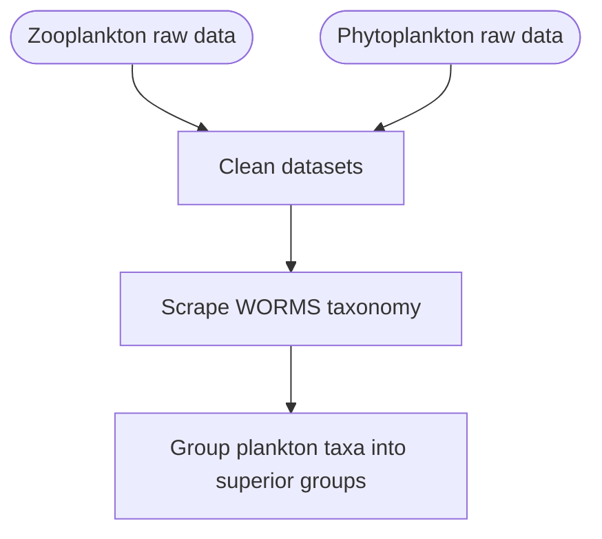

# Data analysis flowchart

Click on nodes to open the relevant files.

```mermaid
flowchart TD
  zooplankton-raw-data([Zooplankton raw data])
  click zooplankton-raw-data "https://gitlab.com/lucien_bastin/Gravelines_plankton_resilience_paper/-/blob/master/Data/Raw/DOME_ZP_IGA_GRAVELINES_Ready_version_2024.csv"

  phytoplankton-raw-data([Phytoplankton raw data])
  click phytoplankton-raw-data "https://gitlab.com/lucien_bastin/Gravelines_plankton_resilience_paper/-/blob/master/Data/Raw/DOME_PP_IGA_GRAVELINES_Ready_version_2024.csv"

  clean-datasets[Clean datasets]
  click clean-datasets "https://gitlab.com/lucien_bastin/Gravelines_plankton_resilience_paper/-/blob/master/Output/Notebooks/01_clean_data.md"

  scrape-worms-taxo[Scrape WORMS taxonomy]
  click scrape-worms-taxo "https://gitlab.com/lucien_bastin/Gravelines_plankton_resilience_paper/-/blob/master/Output/Notebooks/02_scrape_WORMS_taxonomy.md"

  group-plankton-taxa[Group plankton taxa into superior groups]
  click group-plankton-taxa "https://gitlab.com/lucien_bastin/Gravelines_plankton_resilience_paper/-/blob/master/Output/Notebooks/03_taxonomic_grouping.md"

  zooplankton-raw-data & phytoplankton-raw-data --> clean-datasets
  clean-datasets --> scrape-worms-taxo
  scrape-worms-taxo --> group-plankton-taxa
```